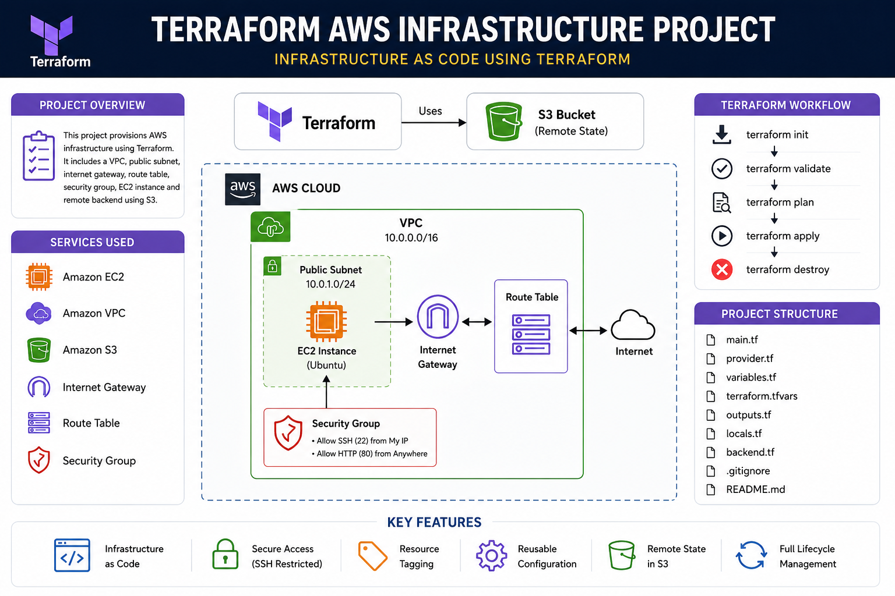

# Terraform AWS Infrastructure Project

## Project Architecture



---

# Project Overview

This project demonstrates production-style AWS infrastructure provisioning using Terraform.  
The infrastructure is fully automated using Infrastructure as Code (IaC) principles.

The project provisions:
- Custom VPC
- Public Subnet
- Internet Gateway
- Route Table
- Security Group
- EC2 Ubuntu Instance
- Remote Terraform Backend using S3

---

# Objectives

- Learn Terraform practically
- Automate AWS infrastructure provisioning
- Understand Infrastructure as Code
- Practice production-style Terraform workflow
- Configure secure networking
- Implement remote Terraform state management

---

# AWS Services Used

| Service | Purpose |
|---|---|
| EC2 | Ubuntu server |
| VPC | Private cloud network |
| Subnet | Public subnet for EC2 |
| Internet Gateway | Internet access |
| Route Table | Routing traffic |
| Security Group | Firewall rules |
| S3 | Remote Terraform backend |

---

# Architecture Flow

Terraform → S3 Backend → AWS Infrastructure

AWS Infrastructure Includes:
- VPC
- Public Subnet
- Internet Gateway
- Route Table
- Security Group
- EC2 Ubuntu Instance

---

# Project Folder Structure

```bash
terraform-prod-project/
├── main.tf
├── provider.tf
├── variables.tf
├── terraform.tfvars
├── outputs.tf
├── locals.tf
├── backend.tf
├── .gitignore
├── README.md
└── project_img.png

Terraform Files Explanation
provider.tf

Configures AWS provider and region.

variables.tf

Contains reusable variables.

terraform.tfvars

Stores variable values.

main.tf

Contains all AWS infrastructure resources.

outputs.tf

Displays output values after deployment.

locals.tf

Stores reusable local values and tags.

backend.tf

Configures remote S3 backend for Terraform state.

.gitignore

Prevents sensitive files from uploading to GitHub.

Features Implemented
Infrastructure as Code
Secure SSH Access
Dynamic Ubuntu AMI Lookup
Reusable Variables
Resource Tagging
Remote Terraform Backend
Production-style Project Structure
Security Improvements
Restricted SSH access to admin public IP
Sensitive files excluded using .gitignore
Remote state management using S3 backend
Terraform Workflow
Initialize Terraform
terraform init
Validate Configuration
terraform validate
Check Execution Plan
terraform plan
Deploy Infrastructure
terraform apply
Destroy Infrastructure
terraform destroy
Remote Backend Configuration

Terraform state is stored remotely in AWS S3 backend.

Benefits:

Centralized state management
Better collaboration
Safer state handling
Production-style workflow
Infrastructure Created

The project creates:

1 VPC
1 Public Subnet
1 Internet Gateway
1 Route Table
1 Route Table Association
1 Security Group
1 EC2 Ubuntu Instance
1 S3 Backend Bucket
SSH Access

SSH access is restricted to the administrator public IP.

Example:

cidr_blocks = ["YOUR_PUBLIC_IP/32"]
Dynamic Ubuntu AMI

The latest Ubuntu AMI is automatically fetched using Terraform data source.

Example:

data "aws_ami"
Production Concepts Practiced
Infrastructure as Code
Terraform State Management
Remote Backend
Secure Networking
Terraform Variables
Terraform Outputs
Resource Tagging
Infrastructure Lifecycle Management
Learning Outcomes

After completing this project, you will understand:

Terraform basics
AWS infrastructure provisioning
Terraform workflow
Remote backend management
Secure cloud networking
Production-style Terraform practices
Author

Abhishek
DevOps & Cloud Engineering Lab Project
